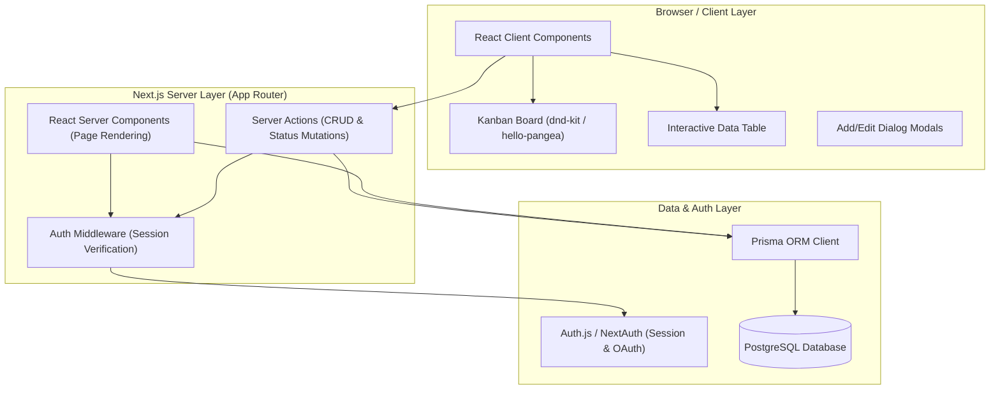
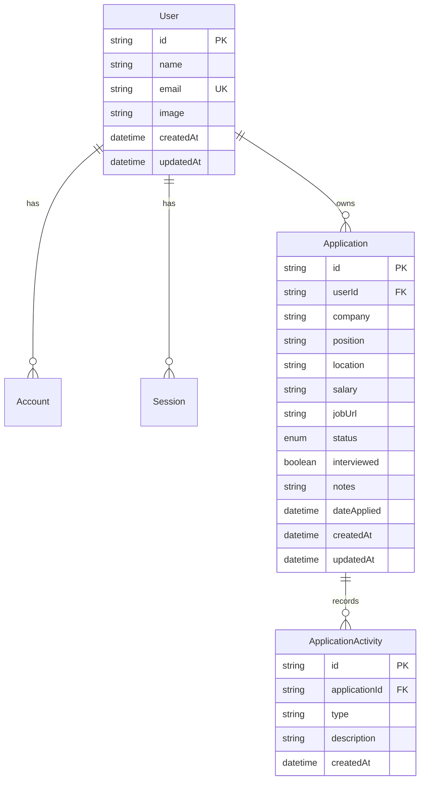

# Design Specification — Job Application Tracker

## 1. System Overview & Architecture

The **Job Application Tracker** is a full-stack, responsive web application designed for job seekers to manage, monitor, and organize their job search workflow. 

The application utilizes Next.js App Router with React Server Components (RSC) and Server Actions for fast, secure server-side execution and data mutation, backed by Prisma ORM and a PostgreSQL relational database. Multi-user isolation is enforced via session-based authentication.



---

## 2. Technology Stack & Key Libraries

| Category | Technology / Library | Rationale |
|---|---|---|
| **Framework** | Next.js 14+ (App Router, TypeScript) | Server Component efficiency, built-in routing, and seamless Server Actions integration. |
| **Styling & UI** | Tailwind CSS + shadcn/ui | Modern, cohesive design system with dark/light theme support and pre-styled accessible primitives. |
| **Icons** | Lucide React | Clean, standard UI icon library. |
| **Drag & Drop** | `@hello-pangea/dnd` or `dnd-kit` | Smooth drag-and-drop interaction for moving application cards between Kanban status columns. |
| **Database & ORM** | PostgreSQL + Prisma ORM | Strongly typed data access, seamless migrations, relational schema integrity. |
| **Authentication** | Auth.js (NextAuth.js v5) | Secure multi-user authentication with Google OAuth / Credentials support and server-side session control. |
| **Validation** | Zod + React Hook Form | Type-safe form validation shared between client and server actions. |
| **State & Optimistic UI**| React `useOptimistic` + Server Actions | Instant UI feedback on drag-and-drop and toggle actions before server roundtrips complete. |

---

## 3. Database Schema Design (Prisma)

### 3.1 Entity Relationship Diagram (ERD)



### 3.2 Prisma Schema Definition (`prisma/schema.prisma`)

```prisma
datasource db {
  provider = "postgresql"
  url      = env("DATABASE_URL")
}

generator client {
  provider = "prisma-client-js"
}

enum ApplicationStatus {
  APPLIED
  INTERVIEWING
  OFFER
  REJECTED
}

model User {
  id            String        @id @default(cuid())
  name          String?
  email         String?       @unique
  emailVerified DateTime?
  image         String?
  accounts      Account[]
  sessions      Session[]
  applications  Application[]
  createdAt     DateTime      @default(now())
  updatedAt     DateTime      @updatedAt
}

model Account {
  id                String  @id @default(cuid())
  userId            String
  type              String
  provider          String
  providerAccountId String
  refresh_token     String? @db.Text
  access_token      String? @db.Text
  expires_at        Int?
  token_type        String?
  scope             String?
  id_token          String? @db.Text
  session_state     String?

  user User @relation(fields: [userId], references: [id], onDelete: Cascade)

  @@unique([provider, providerAccountId])
}

model Session {
  id           String   @id @default(cuid())
  sessionToken String   @unique
  userId       String
  expires      DateTime
  user         User     @relation(fields: [userId], references: [id], onDelete: Cascade)
}

model Application {
  id          String            @id @default(cuid())
  userId      String
  user        User              @relation(fields: [userId], references: [id], onDelete: Cascade)
  company     String
  position    String
  location    String?
  salary      String?
  jobUrl      String?
  status      ApplicationStatus @default(APPLIED)
  interviewed Boolean           @default(false)
  notes       String?           @db.Text
  dateApplied DateTime          @default(now())
  activities  ApplicationActivity[]

  createdAt   DateTime          @default(now())
  updatedAt   DateTime          @updatedAt

  @@index([userId])
  @@index([userId, status])
}

model ApplicationActivity {
  id            String      @id @default(cuid())
  applicationId String
  application   Application @relation(fields: [applicationId], references: [id], onDelete: Cascade)
  type          String      // e.g. "STATUS_CHANGE", "INTERVIEW_TOGGLED", "NOTE_ADDED"
  description   String
  createdAt     DateTime    @default(now())

  @@index([applicationId])
}
```

---

## 4. UI/UX & Component Architecture

### 4.1 Page Layout & Routing Structure

```text
app/
├── (auth)/
│   ├── login/page.tsx
│   └── register/page.tsx
├── (dashboard)/
│   ├── layout.tsx              # Navigation bar, user menu, container layout
│   ├── page.tsx                # Main Dashboard (View Switcher + Metrics + Board/Table)
│   └── applications/
│       └── [id]/page.tsx       # Detailed application view & activity history
├── api/
│   └── auth/[...nextauth]/     # Auth.js API route handler
└── globals.css
```

### 4.2 Core View Modes: Dual View System

The application offers two seamless view modes accessible via a persistent segment toggle on the top toolbar:

1. **Kanban Board View (Default)**
   - 4 Status Columns: `Applied`, `Interviewing`, `Offer`, `Rejected`
   - Cards display: Company Name, Job Title, Applied Date, "Interviewed" Stamp, and Action Menu
   - Drag & drop moving a card between columns automatically triggers `updateApplicationStatusAction`
   - Dropping into `Interviewing` or dragging from `Applied` to `Interviewing` auto-stamps `interviewed = true`
2. **Interactive Data Table View**
   - Dense sortable list by Date, Company, Position, or Status
   - Inline search bar and multi-select status filter
   - Quick action buttons per row (Mark Interviewed toggle, Edit dialog, Delete confirmation)

```mermaid
graph TD
    DashboardPage["Dashboard Page (app/(dashboard)/page.tsx)"]
    MetricsBar["Metrics Summary Bar (Total, Interviewing, Offer, Rejected, Response %)"]
    ViewSwitcher["View Switcher Toggle (Kanban vs Table)"]
    KanbanComp["Kanban Board Component"]
    TableComp["Data Table Component"]
    AddModal["Add Application Dialog"]
    EditModal["Edit Application Dialog"]

    DashboardPage --> MetricsBar
    DashboardPage --> ViewSwitcher
    DashboardPage --> AddModal
    ViewSwitcher -- Mode = "kanban" --> KanbanComp
    ViewSwitcher -- Mode = "table" --> TableComp
    KanbanComp --> EditModal
    TableComp --> EditModal
```

### 4.3 Visual Design System & Aesthetics

- **Color Palette:** Sleek dark mode by default with rich accent highlights:
  - Applied: Indigo / Slate (`bg-indigo-500/10 text-indigo-400 border-indigo-500/20`)
  - Interviewing: Amber / Yellow (`bg-amber-500/10 text-amber-400 border-amber-500/20`)
  - Offer: Emerald / Green (`bg-emerald-500/10 text-emerald-400 border-emerald-500/20`)
  - Rejected: Rose / Red (`bg-rose-500/10 text-rose-400 border-rose-500/20`)
- **Interviewed Badge:** Distinct purple badge/stamp ("🎙️ Interviewed") on application cards.
- **Typography & Components:** Inter / Sans font via Google Fonts, glassmorphism cards (`backdrop-blur-md border-white/10`), micro-animations on button hover and card drag.

---

## 5. Server Actions & API Contract

Data mutations are handled cleanly via strongly typed Server Actions located in `actions/application-actions.ts`:

```typescript
// Input validation schemas via Zod
export const ApplicationSchema = z.object({
  company: z.string().min(1, "Company name is required"),
  position: z.string().min(1, "Position title is required"),
  location: z.string().optional(),
  salary: z.string().optional(),
  jobUrl: z.string().url("Invalid URL format").optional().or(z.literal("")),
  status: z.enum(["APPLIED", "INTERVIEWING", "OFFER", "REJECTED"]),
  interviewed: z.boolean().default(false),
  notes: z.string().optional(),
  dateApplied: z.coerce.date(),
});

// Server Actions
export async function createApplicationAction(data: z.infer<typeof ApplicationSchema>);
export async function updateApplicationAction(id: string, data: Partial<z.infer<typeof ApplicationSchema>>);
export async function updateApplicationStatusAction(id: string, newStatus: ApplicationStatus);
export async function toggleInterviewedAction(id: string);
export async function deleteApplicationAction(id: string);
```

### Server Action Workflow & Optimistic UI Update

1. User moves card on Kanban or toggles "Interviewed".
2. Client Component triggers `useOptimistic` hook to update UI immediately without waiting for network.
3. Server Action executes:
   - Auth check verifies active session (`auth()`).
   - Query filters by `userId` to prevent unauthorized cross-user modifications.
   - Prisma updates database record and creates an `ApplicationActivity` log entry.
   - `revalidatePath('/page')` clears Next.js server cache.
4. If server action fails, optimistic UI automatically reverts and displays a toast error notification.

---

## 6. Security, Isolation & Error Handling

1. **User Isolation:** All database reads and writes enforce `where: { userId: session.user.id }`.
2. **Form Sanitization:** Zod validates input types and string boundaries both client-side and server-side.
3. **Route Protection:** Middleware (`middleware.ts`) redirects unauthenticated requests attempting to access `/dashboard` or `/applications` to `/login`.
4. **Graceful Error Handling:** Toast notifications (via shadcn `sonner` / `toast`) display friendly error messages on network or server failures.

---

## 7. Traceability with Project Plan & Task Checklist

This design directly fulfills the architectural requirements set in `docs/PRD.md`, `docs/Plan.md`, and `docs/Task.md`:

- **PRD Alignment:** Multi-user support, status tracking, interviewed stamp logic, dual Kanban + List UI, dashboard analytics.
- **Plan Phase Alignment:**
  - *Phase 0/1:* Next.js App Router + Prisma Postgres setup.
  - *Phase 2:* Dual-view Kanban + Table implementation with Server Actions.
  - *Phase 4:* Multi-user Auth.js integration with user-isolated Prisma schema.
